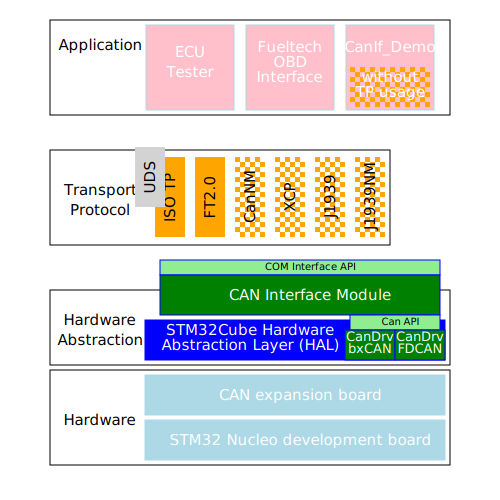

# STM32Cube Expansion Pack CAN Stack
Com-Stack for CAN using the [STM32ExpansionPack system](https://wiki.st.com/stm32mcu/wiki/Introduction_to_STM32Cube_Expansion_Packages) (external link to STM-page).  

## The idea of this piece of code
I had done some work on automotive projects with software based on the AUTomotive Open System ARchitecture, [AUTOSAR](https://www.autosar.org). So I become a friend of the layered structure. On private have searched for a nice handling software to manage code generation to create configurations like it is done in AUTOSAR-software.  
After a few years without written any code lines, I came back to play with STM32 controller boards. The STM32CubeMX or STM32CubeIDE gave me the possibility to add code generation for my own piece of code. So I started to build the STM32 Expansion Pach "CAN Stack".

Acording to other STM32Cube Expansion Packs the archicture will be like:

## Dependencies
+ The software using the STM32Cube system based on the STM32 HAL.
+ Because of the use of gcc compiler inside the STM32CubeIDE, this is my compiler. Adds are welcome.
+ Today the Expansion Pack is for STM32 controller with the bxCAN controller. To extend for other controller it needs to adjust the hardware interfacing class. The better way will be to do it like AUTOSAR. To add a controller dependend CAN-class and bring the CanIf-class to be controller independend.

## This isn't a compilable project at all
The including code is to build the ExpansionPack with the **STM32PackCreator**.  
There are some hand-made changes inside to use C++ instead of the plain-C. 
So be careful when you touching templates for code generation.

+ The "source" folder holds the source to build the STM32ExpansionPack (using the **STM32PackCreator**).  
+ The "pack" folder is the working directory of the **STM32PackCreator**. So it holds the creator project file and the prepared templates for code generation.
+ There will be compileable projects inside the "projects" folder. These projects are intend as tutorials of the expansion pack.   
* The "Sandbox" project is the project to develop the source code of the pack.  
* the first project "CanIf_AppDemo shows how to integrate the ExpansionPack and how do basically configurations.

## Source code documentation
+ *sorry, I am not able to link to the docu :-(*  

There will be also the doxygen generated [source code documentation](docs/index.html). This docu don't comes from the pack it self. You can build this docu inside a project using the ExpansionPack.  
Besides the normal source code documentation it includes a detailed description in german language for usage and internal behavior. If somebody can add a multi language support to doxygen it would be nice.
